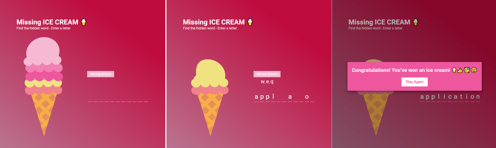

# Udemy--vanillawebprojects-07

**The seventh** of a series of **20 small projects** in **Vanilla JavaScript** from the [**Udemy course**](https://www.udemy.com/course/web-projects-with-vanilla-javascript/) by author [Brad Traversy](https://www.traversymedia.com/) with this [Brad's original GitHub repository](https://github.com/bradtraversy/vanillawebprojects).

# 07: Hangman Game

Select a letter to figure out a hidden word in a set amount of chances.

## Project Specifications

- Display hangman pole and figure using SVG
- Generate a random word
- Display word in UI with correct letters
- Display wrong letters
- Show notification when select a letter twice
- Show popup on win or lose
- Play again button to reset game

## Original preview

    

## My solution preview

    

## My solution features

- Responsive design
- Custom **UI/UX design**
- Instead of drawing a hanged man, **scoops of ice cream decrease** from an ice cream cone (**5 attempts**). If only the cone remains, you lose. - _This is a less morbid version, suitable for children, for example_.
- key words are **application**, **programming**, **interface**, **wizard**
- after winning/losing a round, pressing (**enter** or **space**) starts a new round with a new word

# Author

Website - [Petr Bednarski](https://github.com/pettik)  
Frontend Mentor - [@pettik](https://www.frontendmentor.io/profile/pettik)
